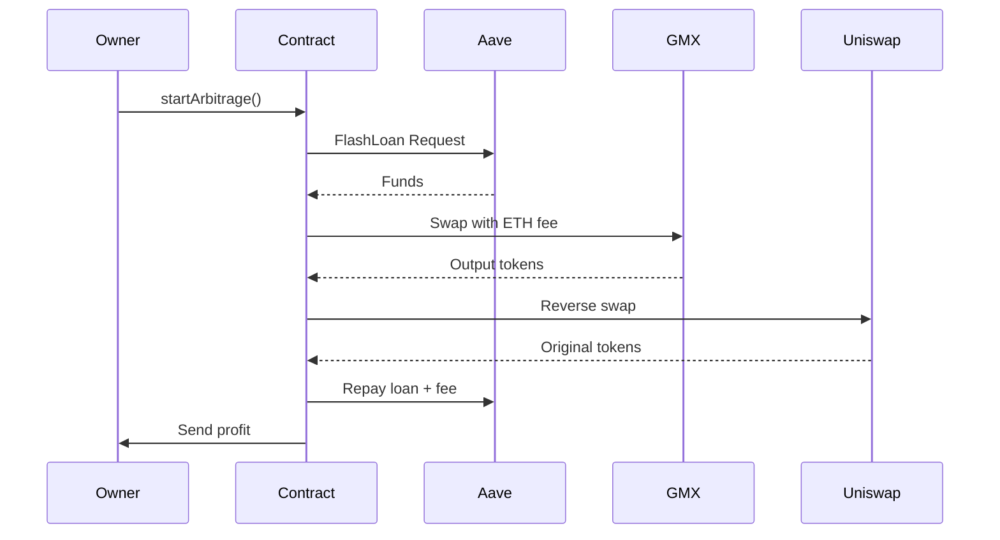

# GMX V2 Arbitrage Smart Contract  
**Author:** Erik Lochashvili  
**Network:** Arbitrum One  

## Overview  
Flash loan-powered arbitrage between GMX V2 and Uniswap. Capital-efficient MEV execution using Aave V3 loans.  

## Features  
- GMX V2 and Uniswap V2 integration  
- Aave V3 flash loans  
- Profit auto-extraction  
- Custom slippage control  
- Owner-restricted access  

## Deployment  
```javascript
const GMXArbitrageur = await ethers.getContractFactory("GMXArbitrageur");
const contract = await GMXArbitrageur.deploy(
  "0x794a61358D6845594F94dc1DB02A252b5b4814aD",  // Aave
  "0x...",  // GMX V2 Router
  "0x1b02dA8Cb0d097eB8D57A175b88c7D8b47997506"   // Uniswap
);
```

## Execution  
```javascript
await contract.startArbitrage(
  borrowToken,        // e.g. USDC
  borrowAmount,       // e.g. 1000e6
  targetToken,        // e.g. WETH
  gmxMarket,          // GMX market address
  gmxMinOut,          // Min GMX output
  uniswapMinOut,      // Min Uniswap output
  executionFee        // ETH for GMX execution
);
```

## Configuration  
```javascript
// Set slippage (50 = 0.5%)
await contract.setSlippageTolerance(50);

// Withdraw tokens
await contract.rescueTokens(tokenAddress);
```

## Workflow  
1. Detect price discrepancy off-chain  
2. Calculate minOut values with slippage buffer  
3. Execute `startArbitrage()` with ETH for fees  
4. Contract:  
   - Takes flash loan  
   - Swaps on GMX V2  
   - Swaps on Uniswap  
   - Repays loan  
   - Sends profit to owner  

> **Warning**  
> Requires ETH for GMX execution fees. Test with small amounts first.  

